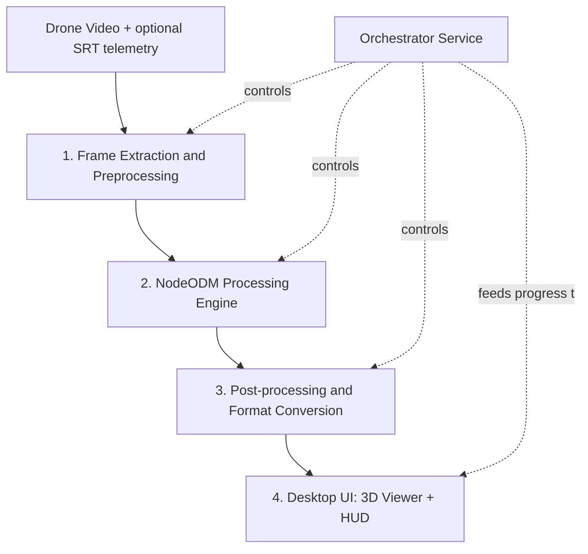
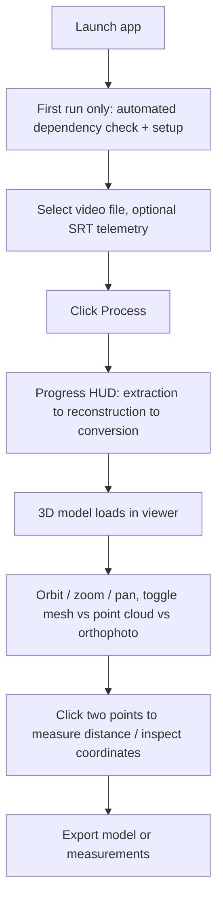
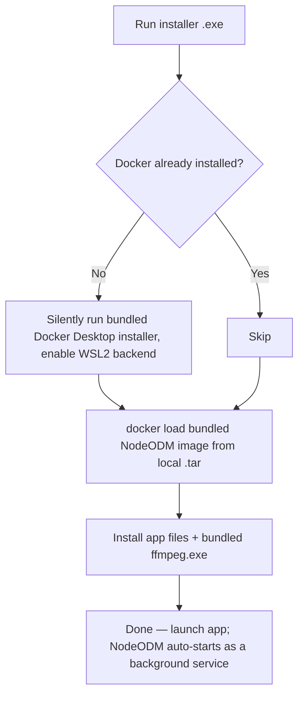

# Digital Twin — MVP Build Specification
**SIH26158 / Problem Statement 17 — "Single-Pass Drone Video to Accurate 3D Model Generation System"**
Sponsor: NTRO (National Technical Research Organisation) · Category: Software · Theme: Drone/Robotics

This is the single source of truth for this build — for human engineers and for AI coding agents working on any part of the pipeline. If a decision in this doc needs to change, update this doc in the same commit.

---

## 1. Executive Summary

A Windows desktop application that converts a single drone flight video into an accurate, georeferenced, interactive 3D model — fully automated, with zero manual intermediate steps and zero manual dependency installation for the end user.

Core engine: **ODM (OpenDroneMap)**, run headless via **NodeODM**. Our own code covers everything around it — frame extraction, dependency bootstrapping, orchestration, and a custom "holographic" viewer UI, packaged as a single installable `.exe`.

Primary differentiators over "raw ODM": full automation (video in, model out, one click), offline/local-only processing (no cloud upload of potentially sensitive imagery), and a purpose-built inspection UI with measurement tools rather than a generic map viewer.

---

## 2. Problem Statement Recap & MVP Goals

**Ask:** single-pass drone video → accurate 3D model generation system.
**Use cases:** military reconnaissance, disaster-response assessment. Both value **accuracy and usable measurements** over visual polish — this governs every decision below.

**MVP goals:**
- User loads a video → clicks one button → gets a viewable, measurable 3D model. No manual frame extraction, no manual tool switching, no command-line steps.
- Output is georeferenced (real-world scale, correct orientation) whenever the source video carries GPS telemetry.
- Ships as a packaged Windows application that a new machine can install and run **without the user manually downloading ffmpeg, Docker, or ODM separately.**
- Fully local processing — no imagery leaves the machine.

---

## 3. Success Metrics

These are the numbers the team should validate against as the build progresses — treat them as targets, not guarantees, until measured on real hardware:

| Metric | Target |
|---|---|
| Manual steps from video file to 3D model | 1 (click "Process") |
| Fresh-machine setup to first successful run | Fully automated except one possible BIOS step (see §7) |
| Processing time, ~2 min video, dev machine (Threadripper/RTX 4500 Ada) | Under ~5 minutes at high quality |
| Processing time, ~2 min video, mid-range demo machine | Under ~15 minutes at medium/low quality preset |
| Positional accuracy | Within typical consumer-GPS accuracy (~2–5 m) when EXIF/telemetry GPS is present; unbounded/relative-only if no telemetry exists |
| Viewer interactivity | ≥30 fps orbit/zoom on an RTX 4060-class GPU |
| Cloud dependency | Zero — no imagery or model data ever leaves the device |

---

## 4. System Architecture

| # | Component | Owns |
|---|---|---|
| 1 | Frame Extraction Service | video → clean, geotagged image set |
| 2 | Processing Engine (NodeODM) | image set → orthophoto, DSM/DTM, mesh, point cloud |
| 3 | Orchestrator / Post-processor | job lifecycle, progress, format conversion for the viewer |
| 4 | Desktop UI | file picker, progress display, 3D viewer, measurement tools |

Each component is independently testable — this matters more than usual given a small team and a hard deadline.

---

## 5. User Flow

No step in the user-facing flow (U3 onward) involves a terminal, a file path, or a separate tool.

---

## 6. Tech Stack

| Layer | Choice | Why |
|---|---|---|
| Frame extraction | Python + `ffmpeg` (bundled binary) + OpenCV | Full control over sampling logic, no external install needed (see §7) |
| Blur/dedup filtering | OpenCV (Laplacian variance) + perceptual hashing | Cheap, no GPU needed, removes bad frames before they cost reconstruction time |
| Telemetry parsing | Custom SRT/metadata parser + `piexif` | Injects GPS into EXIF so ODM can georeference automatically |
| Processing engine | **NodeODM** (Docker container, `opendronemap/nodeodm`, image bundled — see §7) | Turnkey REST API around ODM; no need to touch WebODM's own frontend at all |
| Orchestrator/backend | Python (FastAPI) or Node (Express) | Manages the pipeline, talks to NodeODM, serves progress to the UI over WebSocket |
| 3D viewer | Three.js or CesiumJS | Renders mesh/point cloud output; CesiumJS if satellite base-map alignment is in scope |
| Desktop packaging | **Electron** | Ships the web-based UI as a native-feeling `.exe`; matches the team's web skillset |
| Point cloud web rendering (if needed) | Potree | Handles large `.laz` point clouds in-browser without choking |
| Installer | Inno Setup or NSIS | Scriptable Windows installer capable of silent prerequisite installs (see §7) |

---

## 7. Solving the Dependency Problem: Zero Manual Installs

This is the biggest usability risk in the current plan and needs to be designed in from day one, not patched on later.

**The problem:** as originally scoped, a new machine needs `ffmpeg`, Docker, and the ODM/NodeODM image installed *separately* before the app works — that's not "automated," that's a manual setup guide.

**The fix — a single installer that provisions everything:**

Concretely:
1. **`ffmpeg` — bundle it, don't require it.** Ship a static, redistributable `ffmpeg.exe` inside the app's own resources folder (e.g. via the `ffmpeg-static` npm package or a static build embedded directly). The app calls its own bundled binary. The user never installs or even knows ffmpeg exists.
2. **Docker — auto-provision it.** Docker Desktop supports a documented silent/unattended install (`Docker Desktop Installer.exe install --quiet --accept-license`), which can be scripted as a step inside your own Inno Setup/NSIS installer. On first run, the installer checks whether Docker is already present; if not, it runs the bundled Docker Desktop installer silently and enables the WSL2 backend automatically.
3. **The NodeODM image — bundle it, don't pull it.** Instead of `docker pull opendronemap/nodeodm` at runtime (which needs internet and adds setup time), ship the image as a pre-exported `.tar` file inside the installer and run `docker load` from it locally. This also directly serves the offline/field-use requirement already in §9 — no internet needed at all after install.
4. **Auto-start, don't ask.** The Electron app manages the NodeODM container's lifecycle itself (start it as a background service when the app launches, stop it on exit) — the user never runs a `docker` command.

**One honest limitation:** Docker's WSL2 backend requires hardware virtualization enabled in BIOS/UEFI. On some OEM machines this ships disabled, and no installer can flip a BIOS setting without a reboot into firmware — that one step genuinely can't be made silent. The installer should **detect** this case and show the user a clear one-time instruction rather than failing silently. Framed honestly: this plan removes *all* of the manual downloads and configuration; the BIOS case is the one edge case that stays a (rare) manual step, and it's on the user's machine, not something we introduce.

**Longer-term option (post-MVP):** a native, non-Docker Windows build of ODM would remove the Docker dependency entirely. This is a meaningfully larger engineering effort (ODM's own maintainers primarily support Docker/WSL2 on Windows because of how many native C++ dependencies — GDAL, PDAL, Ceres, OpenCV, OpenSfM, OpenMVS — it carries), so treat it as a future infrastructure improvement, not an MVP blocker.

---

## 8. Pipeline Stages — Detailed

### Stage 0 — Input
User selects a video file (and, if available, its companion `.SRT` telemetry file) through the desktop UI. Nothing else required.

### Stage 1 — Frame Extraction & Preprocessing (our custom module)
1. Extract frames with the bundled `ffmpeg` at a higher base rate than needed (e.g. 2–4 fps).
2. Score each frame with a Laplacian-variance sharpness check; drop frames below a blur threshold.
3. Remove near-duplicate frames (perceptual hash / optical-flow displacement) to target ~70–80% image overlap.
4. If telemetry is present, parse per-frame GPS/altitude/gimbal data and write it into each retained frame's EXIF GPS tags.
5. Output: a folder of clean, geotagged JPEGs — exactly what ODM expects.

### Stage 2 — Processing (NodeODM)
1. Orchestrator submits the frame folder to NodeODM (`POST /task/new`) with a quality preset (see §10 for low-end tuning).
2. Orchestrator polls `GET /task/{uuid}/info`, relays progress to the UI.
3. On completion: orthophoto (GeoTIFF), DSM/DTM, textured mesh, point cloud (`.laz`).

### Stage 3 — Post-processing
1. Convert mesh to `.glb` if not already web-friendly.
2. Convert/prepare point cloud for the viewer (Potree octree conversion if point counts are large).
3. (Stretch) fetch a reference satellite tile for the same coordinates for overlay.

### Stage 4 — Visualization
Load the reconstructed model into the viewer; orbit/pan/zoom, layer toggle, measurement, inspection. HUD styling applied once the functional viewer works — see §11.

---

## 9. Handling Moving Objects

**Why it matters:** ODM — like all classical structure-from-motion/multi-view-stereo pipelines — assumes a static scene. Moving objects (vehicles, people, animals) break that assumption two ways: they produce inconsistent feature matches across frames, since the same object sits in different positions in different photos of the "same" point; and where they do get reconstructed, they typically show up as ghosting/smeared duplicate geometry in the mesh and floating noise in the point cloud, not a clean model. This isn't just cosmetic for this project — the vehicles and personnel that break a static reconstruction are often exactly what a recon/disaster-response operator is looking for in the first place.

**MVP approach — mask them out, don't try to reconstruct them:**
1. During Stage 1, run a lightweight object detector (e.g. YOLOv8n — small and fast, runs comfortably even on modest hardware) over each retained frame to detect common moving-object classes (person, car, truck, motorcycle, etc.).
2. For each detection, generate a black/white mask image matched to ODM's expected naming convention (`<filename>_mask.JPG` alongside `<filename>.JPG`). ODM 2.0+ natively supports per-image masks and skips reconstruction over the masked (black) regions.
3. Submit the geotagged images and their masks together to NodeODM. Result: the static scene reconstructs cleanly, and masked regions simply aren't reconstructed there instead of producing ghosting artifacts.

**Fallback if masking isn't built in time:** document it as a known limitation rather than hiding it — moving objects will appear as blur/ghosting in affected regions of the mesh. For nadir (straight-down) aerial shots this is usually a small fraction of any given frame and rarely breaks the overall reconstruction, since ODM's bundle adjustment already down-weights outlier feature matches — but don't present it as "clean" to judges without masking actually in place.

**Cherry-on-top extension — track them instead of just discarding them:** run the same detector across the full frame sequence, associate detections into simple per-object tracks (centroid/IoU tracking is enough, no need for a heavy tracker), and project each track's position onto the orthophoto/geospatial coordinate frame using the GPS/EXIF data Stage 1 already computes. This gives a second, complementary output — the clean static 3D model, plus a layer showing where moving vehicles/people were and roughly how they moved — which fits both the recon and disaster-response framing of the PS well, and reuses the same detection work already built for masking. This extends the "Auto-annotation" cherry-on-top idea in §12.

---

## 10. Performance Optimization for Lower-End Devices

The demo machine (RTX 4060, 8GB VRAM) is meaningfully weaker than the dev machine (Threadripper PRO, RTX 4500 Ada 24GB) — the app needs to degrade gracefully rather than assume dev-machine specs everywhere:

- **Tiered quality presets (Low/Medium/High)** mapped to ODM's `--feature-quality`, `--pc-quality`, `--mesh-octree-depth`, and orthophoto resolution flags. Auto-detect CPU core count, RAM, and VRAM on first run and pick a sensible default preset, with manual override available.
- **Input downsampling** — use ODM's `--resize-to` to cap input image resolution on lower-end hardware; this is the single biggest lever on both processing time and memory use.
- **Smarter frame selection over raw frame count** — a well-chosen smaller set of high-overlap, sharp frames reconstructs faster than a larger set of redundant ones, without meaningfully hurting accuracy. This is exactly what Stage 1's filtering already buys you.
- **Skip unneeded outputs** — don't generate DSM/DTM if a given run doesn't need elevation data; each optional output adds processing time.
- **Progressive/preview rendering** — run a fast, low-quality pass first for immediate feedback, then a background high-quality pass. Improves perceived responsiveness on any hardware, especially low-end, and is good UX regardless.
- **Adaptive level-of-detail in the viewer** — generate a decimated low-poly mesh alongside the full-resolution one, and have the UI pick based on detected GPU; Potree already does adaptive point-budget rendering for point clouds, use that rather than rendering the full cloud unconditionally.
- **Split-hardware option** — since you already have both machines, the architecture supports (optionally) running the heavy NodeODM processing on the powerful dev machine over the local network while the lightweight machine only runs the viewer. Not needed for MVP, but worth keeping the orchestrator's NodeODM endpoint configurable (not hardcoded to `localhost`) in case this is useful during development or the live demo.

---

## 11. UI/UX Direction

Visual language: dark, glass-panel "holographic HUD" aesthetic — the 3D viewport is the dominant element, with floating, semi-transparent control panels rather than a conventional toolbar/ribbon layout. Frameless Electron window to reinforce the "interface," not "desktop app," feel.

**Key screens/states:**
- **Idle/input state:** drag-and-drop zone for the video file (and optional SRT), minimal and uncluttered.
- **Processing state:** HUD-style progress indicator (radial or segmented bar) reflecting actual pipeline stage — "Extracting frames," "Reconstructing," "Finalizing" — not a generic spinner. Silence during a multi-minute ODM run reads as broken; this is a functional requirement, not decoration.
- **Viewer state:** full-screen 3D viewport, with a collapsible side panel for layer toggles (mesh / point cloud / orthophoto), a measurement tool (click two points → distance readout), and a coordinate/elevation readout on hover or click.
- **Export/handoff:** simple panel to save the current view or export supported formats.

Interaction principle: every control the operator needs during inspection (measure, toggle layers, orbit) should be reachable without leaving the 3D view — this matters for the actual field-use case (recon, damage assessment), not just demo polish.

---

## 12. Feature Scope

### Must-Have (MVP — required to satisfy the problem statement)
- Fully automated pipeline: video in → 3D model out, zero manual intermediate steps
- Zero manual dependency installation (§7)
- Georeferenced, metrically accurate output
- Interactive 3D viewer: orbit, pan, zoom
- Point-to-point distance measurement tool
- Visible, stage-aware progress during processing
- Packaged Windows application
- Fully offline / local processing — no cloud upload of imagery, ever

### Nice-to-Have (build only after Must-Haves work end-to-end)
- Satellite imagery overlay and alignment against the reconstructed model
- Area/volume measurement, saved annotations
- Multi-format export (glb, laz, GeoTIFF)
- Quality preset selector exposed to the user (auto-detected default + manual override)

### Cherry-on-Top (stretch features, build only with time to spare)
- **Gaussian Splatting toggle** — secondary photoreal view mode layered on top of the mesh/point-cloud output, for visual impact in the demo (not for measurement).
- **Change detection** — compare a new reconstruction against a stored earlier one or a satellite baseline, and visually flag differences; strong fit for the disaster-response framing of the PS.
- **Auto-annotation** — run a lightweight object-detection pass over the orthophoto/mesh to auto-flag structures or vehicles, saving an operator manual tagging time. Extends naturally into **moving-object tracking** (§9) — the same detector used to mask vehicles/people out of the static reconstruction can also produce a tracked-positions layer over time.
- **One-click briefing export** — auto-generate a short PDF/image summary (key views + measurements) for handoff to a non-technical stakeholder.
- **Voice/keyboard-shortcut driven inspection mode** — reinforces the "JARVIS" framing for the demo.

### Explicit Non-Goals for MVP
- Multi-drone data fusion
- Real-time processing during flight
- Any cloud/multi-user deployment

---

## 13. Technical & System Requirements

| | Development machine (known) | Demo / target machine (minimum) |
|---|---|---|
| CPU | AMD Threadripper PRO 7975WX (32-core) | 8-core modern CPU |
| RAM | 128 GB | 16 GB minimum |
| GPU | RTX 4500 Ada, 24 GB VRAM | ≥6 GB VRAM (viewer needs this more than the reconstruction step does) |
| OS | Windows 10/11 64-bit | Windows 10 64-bit (1903+) or Windows 11 — required for WSL2 |
| Virtualization | N/A (already enabled) | Must be enabled in BIOS/UEFI for Docker's WSL2 backend — see §7 for how this is handled |
| Storage | 1.38 TB available | ~20 GB free (Docker image + working files + outputs) |
| Network | N/A | None required after install — fully offline-capable by design |

---

## 14. Tooling Note — Frame Extraction

`sakthivelj/video2image` was evaluated and is **not used**: it's a minimal, largely unmaintained (2 stars, essentially one bugfix commit since 2023) wrapper around basic frame dumping with no blur filtering, no overlap control, and no GPS/EXIF handling — it doesn't do any of the work Stage 1 actually needs. Our own bundled-`ffmpeg`-based extractor (§8, Stage 1 and §7) is the right call.

---

## 15. Build Order (for engineers and AI coding agents)

1. **Stage 1 module** — frame extraction + blur filtering + dedup + EXIF geotagging, using the bundled ffmpeg binary from the start (not a system install) so this is never re-plumbed later. Testable standalone against existing test video.
2. **NodeODM up and reachable** — via the bundled Docker image (`docker load`), confirm output quality matches the earlier manual WebODM test.
3. **Orchestrator** — glue Stage 1 → Stage 2, with progress polling exposed over a local API/WebSocket, quality-preset selection wired in (§10).
4. **Bare-bones viewer** — load a static, already-processed model file in Three.js/Cesium. Prove rendering before wiring live data.
5. **End-to-end wiring** — file picker → full pipeline → viewer, zero manual steps anywhere in the chain.
6. **Moving-object masking** — add the detector + mask-generation step from §9 into Stage 1, confirm masked runs come out cleaner than unmasked ones on footage containing traffic/people.
7. **Installer** — build the Inno Setup/NSIS installer with the Docker auto-provisioning logic from §7. Do this before final packaging, not as an afterthought — test on a genuinely clean machine/VM, not just dev machines that already have Docker installed.
8. **Electron packaging** of the working UI into the final `.exe`.
9. **Measurement tools + HUD polish** (§11, §12 Must-Haves).
10. **Nice-to-haves and Cherry-on-Top features**, in priority order, only as time allows.

Each stage should be built and verified independently before wiring to the next.
